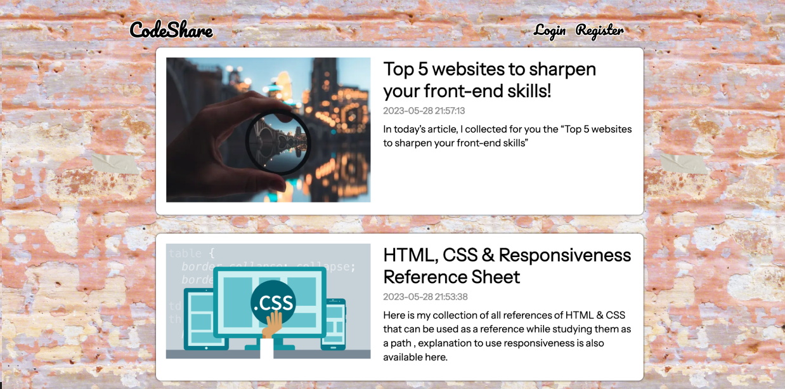

 

  

  <h3 align="center">This blog is a developer sharing information blog that includes a CRUD (create, read, update, delete) application for managing blog posts.</h3>

  

    <a href="https://github.com/AtenaHatta/blog-app"><strong>Explore the docs »</strong></a>
     
     
    <a href="https://github.com/AtenaHatta/blog-app">View Demo</a>
    .
    <a href="https://github.com/AtenaHatta/blog-app/issues">Report Bug</a>
    .
    <a href="https://github.com/AtenaHatta/blog-app/issues">Request Feature</a>
  

## About The Project

In this blog, users can view the posts submitted by each user. Additionally, by registering, users can set up their username and password, allowing them to log in. Upon successful login, a success message will be displayed. After logging in, users can create new posts like other users. Furthermore, it is also possible to edit or delete posts after they have been submitted.

## Built With

* [Javascript]()
* [React.JS]()
* [Node.js]()
* [Express]()
* [MongoDB]()
* [Mongoose]()

## Getting Started

This is an example of how you may give instructions on setting up your project locally.
To get a local copy up and running follow these simple example steps.

### Installation

1. Clone the repository 
git clone https://github.com/AtenaHatta/blog-app.git

2. Navigate to the project directory 
cd blog-app

3. Install NPM packages 
npm install

4. Run the application 
npm run dev

## Roadmap

See the [open issues](https://github.com/AtenaHatta/blog-app/issues) for a list of proposed features (and known issues).

